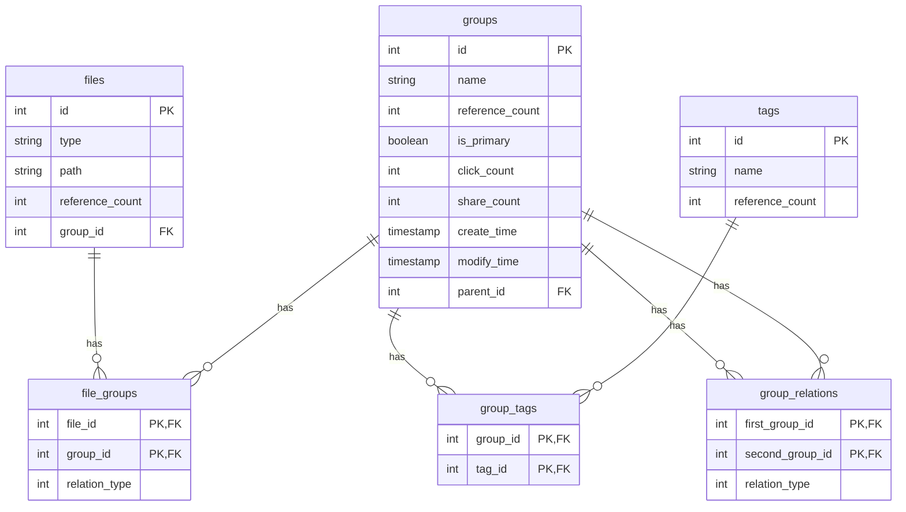

# FileClassificationSolutions Project Structure

This is a Rust-based file classification solution that adopts a modular architecture design, including multiple components such as core library, command-line interface, and Web API.

## Overall Project Structure

```
FileClassificationSolutions/
├── .github/                    # GitHub related configurations
│   └── workflows/             # CI/CD workflow configurations
├── file_classification_cli/   # Command-line interface application
│   ├── src/bin/               # Various independent command-line tools
│   └── Cargo.toml             # CLI package configuration
├── file_classification_core/  # Core library
│   ├── src/
│   │   ├── internal/          # Data access layer
│   │   ├── model/             # Data models and database schema
│   │   ├── service/           # Business logic layer
│   │   └── utils/             # Utility functions
│   └── Cargo.toml             # Core library package configuration
├── file_classification_webapi/ # Web API (Legacy)
│   ├── src/bin/               # Various independent API endpoints
│   └── Cargo.toml             # Web API package configuration
├── file_classification_webapi2/ # Web API (New)
│   ├── src/
│   │   ├── handlers/          # Request handler functions
│   │   └── utils/             # Web API utility functions
│   └── Cargo.toml             # Web API2 package configuration
├── migrations/                # Database migration scripts
└── nix/                      # Nix package management configuration
```


## Core Module Details

### file_classification_core (Core Library)

This is the business logic core of the entire project, containing data models, database access layer, and business services.

#### Directory Structure
```
file_classification_core/
├── src/
│   ├── internal/              # Data access layer (DAO)
│   │   ├── file_group.rs      # File-group association data access
│   │   ├── files.rs           # File data access
│   │   ├── group_tag.rs       # Group-tag association data access
│   │   ├── groups.rs          # Group data access
│   │   └── tags.rs            # Tag data access
│   ├── model/                 # Data models
│   │   ├── models.rs          # All data structure definitions
│   │   └── schema.rs          # Database schema (generated by Diesel)
│   ├── service/               # Business logic layer
│   │   ├── file_group.rs      # File-group association business logic
│   │   ├── files.rs           # File business logic
│   │   ├── group_tag.rs       # Group-tag association business logic
│   │   ├── groups.rs          # Group business logic
│   │   └── tags.rs            # Tag business logic
│   └── utils/                 # Utility functions
│       ├── database.rs        # Database connection management
│       └── errors.rs          # Error handling
└── Cargo.toml                 # Package configuration file
```


#### Core Concepts
- **Files**: Represents specific files in the system, including attributes such as type, path, and reference count
- **Groups**: Used to classify and organize files, with attributes such as name, reference count, and primary group identifier
- **Tags**: Provide additional metadata descriptions for groups to enhance classification capabilities
- **FileGroups**: Establish many-to-many relationships between files and groups
- **GroupTags**: Establish many-to-many relationships between groups and tags

#### Design Principles
1. Use reference counting to track associations between entities
2. Support complex conditional queries, including equals, greater than, less than, LIKE pattern matching, etc.
3. Implement complete CRUD operations, including batch operations through conditions
4. Use transactions to ensure data consistency, especially when handling reference counts
5. Distinguish between primary groups and ordinary groups, where primary groups have a one-to-one relationship with files

### file_classification_cli (Command Line Interface)

Provides command-line tools to operate the file classification system.

#### Directory Structure
```
file_classification_cli/
├── src/bin/                   # Various independent command-line tools
│   ├── create_file_group.rs   # Create file-group association
│   ├── create_group.rs        # Create group
│   ├── create_group_tag.rs    # Create group-tag association
│   ├── create_tag.rs          # Create tag
│   ├── delete_file.rs         # Delete file
│   ├── delete_file_group.rs   # Delete file-group association
│   ├── delete_group.rs        # Delete group
│   ├── delete_group_tag.rs    # Delete group-tag association
│   ├── delete_tag.rs          # Delete tag
│   ├── list_file_groups_by_conditions.rs  # Query file-group associations by conditions
│   ├── list_files.rs          # List files
│   ├── list_files_by_conditions.rs        # Query files by conditions
│   ├── list_group_tags_by_conditions.rs   # Query group-tag associations by conditions
│   ├── list_groups.rs         # List groups
│   ├── list_groups_by_conditions.rs       # Query groups by conditions
│   ├── list_tags.rs           # List tags
│   ├── list_tags_by_conditions.rs         # Query tags by conditions
│   ├── update_files_by_conditions.rs      # Update files by conditions
│   ├── update_groups_by_conditions.rs     # Update groups by conditions
│   └── update_tags_by_conditions.rs       # Update tags by conditions
└── Cargo.toml                 # Package configuration file
```


#### Features
- Provides interactive command-line interface
- Supports complex conditional queries and batch operations
- Includes complete CRUD functionality
- Supports combined condition queries (AND, OR, NOT)

### file_classification_webapi (Web API - New Version)

RESTful API service built on the Actix-web framework.

#### Directory Structure
```
file_classification_webapi/
├── src/
│   ├── handlers/              # API request handler functions
│   │   ├── file_groups.rs     # File-group association API handlers
│   │   ├── files.rs           # File API handlers
│   │   ├── group_tags.rs      # Group-tag association API handlers
│   │   ├── groups.rs          # Group API handlers
│   │   ├── mod.rs             # Module declarations
│   │   └── tags.rs            # Tag API handlers
│   ├── utils/                 # Web API utility functions
│   │   ├── database.rs        # Database connection pool
│   │   ├── mod.rs             # Module declarations
│   │   └── models.rs          # API data transfer objects
│   └── main.rs                # Application entry point
└── Cargo.toml                 # Package configuration file
```


#### API Endpoints
- **File Management**: `/api/files`
- **Group Management**: `/api/groups`
- **Tag Management**: `/api/tags`
- **File-Group Association**: `/api/file-groups`
- **Group-Tag Association**: `/api/group-tags`

### Database Migrations

```
migrations/
└── 2024-10-01-193345_FileClassification/
    ├── up.sql                 # Database table creation script
    └── down.sql               # Database table deletion script
```


Database contains the following tables:
- `files`: Stores file information
- `groups`: Stores file group information
- `file_groups`: Many-to-many association relationship between files and groups
- `tags`: Stores tag information
- `group_tags`: Many-to-many association relationship between groups and tags

### Data Model Relationships




## Architectural Features

1. **Layered Architecture**: The project adopts a clear layered architecture, separating data access, business logic, and presentation layers
2. **Modular Design**: Different functional modules are organized in independent crates
3. **Multiple Access Methods**: Provides both CLI and Web API access methods
4. **Strong Type Safety**: Utilizes Rust's type system to ensure code safety
5. **Error Handling**: Unified error handling mechanism
6. **Database Abstraction**: Uses Diesel ORM for database operations
7. **Scalability**: Easy to add new functional modules and access interfaces

This project structure design supports file classification management, organizing files through groups and tags, and provides multiple access interfaces to accommodate different usage scenarios.