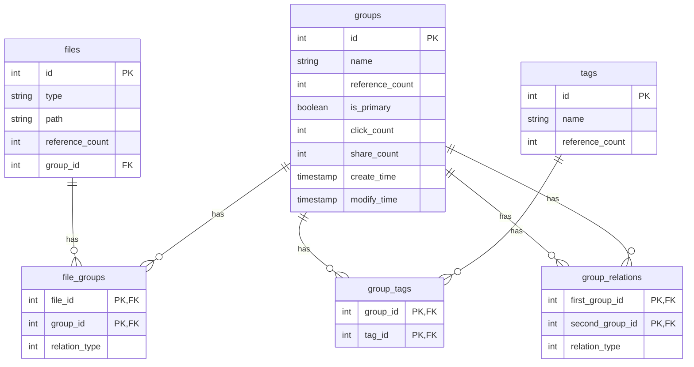

# FileClassificationSolutions Project Structure

This is a Rust-based file classification solution that adopts a modular architecture design, including multiple components such as core library, command-line interface, and Web API.

## Overall Project Structure

```
FileClassificationSolutions/
├── .github/                    # GitHub related configurations
│   └── workflows/             # CI/CD workflow configurations
├── common/                     # Common module
│   ├── src/                   # Source code
│   │   ├── env_loader.rs      # Environment variable loader
│   │   └── lib.rs             # Library entry point
│   └── Cargo.toml             # Package configuration
├── file_classification_cli/   # Command-line interface application
│   ├── example/               # Example script files
│   │   ├── hierarchical_classification.fcc
│   │   ├── hybrid_classification.fcc
│   │   ├── tag_based_classification.fcc
│   │   └── website_classification.fcc
│   ├── src/                   # Source code
│   │   ├── cli.rs             # CLI command parsing
│   │   ├── context.rs         # Context management
│   │   ├── handlers.rs        # Command handlers
│   │   ├── helpers.rs         # Helper functions
│   │   ├── interactive.rs     # Interactive features
│   │   ├── main.rs            # Application entry point
│   │   ├── parsers.rs         # Parsers
│   │   ├── repl.rs            # REPL implementation
│   │   └── utils.rs           # Utility functions
│   ├── tests/                 # Test code
│   │   └── cli.rs
│   └── Cargo.toml             # CLI package configuration
├── file_classification_core/  # Core library
│   ├── src/
│   │   ├── internal/          # Data access layer (DAO)
│   │   │   ├── file_group.rs  # File-group association data access
│   │   │   ├── files.rs       # File data access
│   │   │   ├── group_relations.rs # Group relations data access
│   │   │   ├── group_tag.rs   # Group-tag association data access
│   │   │   ├── groups.rs      # Group data access
│   │   │   ├── mod.rs         # Module declarations
│   │   │   └── tags.rs        # Tag data access
│   │   ├── model/             # Data models
│   │   │   ├── mod.rs         # Module declarations
│   │   │   ├── models.rs      # All data structure definitions
│   │   │   └── schema.rs      # Database schema (generated by Diesel)
│   │   ├── service/           # Business logic layer
│   │   │   ├── file_group.rs  # File-group association business logic
│   │   │   ├── files.rs       # File business logic
│   │   │   ├── group_relations.rs # Group relations business logic
│   │   │   ├── group_tag.rs   # Group-tag association business logic
│   │   │   ├── groups.rs      # Group business logic
│   │   │   ├── mod.rs         # Module declarations
│   │   │   └── tags.rs        # Tag business logic
│   │   ├── utils/             # Utility functions
│   │   │   ├── database.rs    # Database connection management
│   │   │   ├── errors.rs      # Error handling
│   │   │   └── mod.rs         # Module declarations
│   │   └── lib.rs             # Library entry point
│   └── Cargo.toml             # Core library package configuration
├── file_classification_webapi/ # Web API
│   ├── src/bin/               # Binary files
│   │   ├── handlers/          # API request handler functions
│   │   │   ├── file_groups.rs # File-group association API handlers
│   │   │   ├── files.rs       # File API handlers
│   │   │   ├── group_relations.rs # Group relations API handlers
│   │   │   ├── group_tags.rs  # Group-tag association API handlers
│   │   │   ├── groups.rs      # Group API handlers
│   │   │   ├── mod.rs         # Module declarations
│   │   │   ├── tags.rs        # Tag API handlers
│   │   │   └── uploads.rs     # File upload API handlers
│   │   ├── utils/             # Web API utility functions
│   │   │   ├── app_config.rs  # Application configuration
│   │   │   ├── cors.rs        # CORS configuration
│   │   │   ├── database.rs    # Database connection pool
│   │   │   ├── logger.rs      # Logger configuration
│   │   │   ├── mod.rs         # Module declarations
│   │   │   ├── models.rs      # API data transfer objects
│   │   │   ├── server.rs      # Server configuration
│   │   │   └── static_files.rs # Static file serving
│   │   └── file_classification_webapi.rs # Web API entry point
│   ├── static/                # Static assets
│   │   ├── js/                # JavaScript files
│   │   │   ├── config.js
│   │   │   ├── fileGroupManager.js
│   │   │   ├── fileManager.js
│   │   │   ├── groupManager.js
│   │   │   ├── groupRelationManager.js
│   │   │   ├── groupTagManager.js
│   │   │   ├── loader.js
│   │   │   ├── main.js
│   │   │   ├── tagManager.js
│   │   │   └── utils.js
│   │   ├── partials/          # HTML partials
│   │   │   ├── file-groups.html
│   │   │   ├── files.html
│   │   │   ├── group-relations.html
│   │   │   ├── group-tags.html
│   │   │   ├── groups.html
│   │   │   ├── header.html
│   │   │   ├── home.html
│   │   │   ├── modal.html
│   │   │   ├── sidebar.html
│   │   │   └── tags.html
│   │   ├── index.html         # Main page
│   │   ├── styles.css         # Stylesheet
│   │   └── favicon.ico        # Favicon
│   └── Cargo.toml             # Web API package configuration
├── migrations/                # Diesel database migrations
├── migrations_mysql/          # MySQL database migrations
├── migrations_postgres/       # PostgreSQL database migrations
├── migrations_sqlite/         # SQLite database migrations
└── nix/                      # Nix package management configuration
```


## Core Module Details

### file_classification_core (Core Library)

This is the business logic core of the entire project, containing data models, database access layer, and business services.

#### Directory Structure
```
file_classification_core/
├── src/
│   ├── internal/              # Data access layer (DAO)
│   │   ├── file_group.rs      # File-group association data access
│   │   ├── files.rs           # File data access
│   │   ├── group_relations.rs # Group relations data access
│   │   ├── group_tag.rs       # Group-tag association data access
│   │   ├── groups.rs          # Group data access
│   │   ├── mod.rs             # Module declarations
│   │   └── tags.rs            # Tag data access
│   ├── model/                 # Data models
│   │   ├── mod.rs             # Module declarations
│   │   ├── models.rs          # All data structure definitions
│   │   └── schema.rs          # Database schema (generated by Diesel)
│   ├── service/               # Business logic layer
│   │   ├── file_group.rs      # File-group association business logic
│   │   ├── files.rs           # File business logic
│   │   ├── group_relations.rs # Group relations business logic
│   │   ├── group_tag.rs       # Group-tag association business logic
│   │   ├── groups.rs          # Group business logic
│   │   ├── mod.rs             # Module declarations
│   │   └── tags.rs            # Tag business logic
│   ├── utils/                 # Utility functions
│   │   ├── database.rs        # Database connection management
│   │   ├── errors.rs          # Error handling
│   │   └── mod.rs             # Module declarations
│   └── lib.rs                 # Library entry point
└── Cargo.toml                 # Package configuration file
```


#### Core Concepts
- **Files**: Represents specific files in the system, including attributes such as type, path, and reference count
- **Groups**: Used to classify and organize files, with attributes such as name, reference count, and primary group identifier
- **Tags**: Provide additional metadata descriptions for groups to enhance classification capabilities
- **FileGroups**: Establish many-to-many relationships between files and groups
- **GroupTags**: Establish many-to-many relationships between groups and tags

#### Design Principles
1. Use reference counting to track associations between entities
2. Support complex conditional queries, including equals, greater than, less than, LIKE pattern matching, etc.
3. Implement complete CRUD operations, including batch operations through conditions
4. Use transactions to ensure data consistency, especially when handling reference counts
5. Distinguish between primary groups and ordinary groups, where primary groups have a one-to-one relationship with files

### file_classification_cli (Command Line Interface)

Provides command-line tools to operate the file classification system.

#### Directory Structure
```
file_classification_cli/
├── example/                   # Example script files
│   ├── hierarchical_classification.fcc
│   ├── hybrid_classification.fcc
│   ├── tag_based_classification.fcc
│   └── website_classification.fcc
├── src/                       # Source code
│   ├── cli.rs                 # CLI command parsing
│   ├── context.rs             # Context management
│   ├── handlers.rs            # Command handlers
│   ├── helpers.rs             # Helper functions
│   ├── interactive.rs         # Interactive features
│   ├── main.rs                # Application entry point
│   ├── parsers.rs             # Parsers
│   ├── repl.rs                # REPL implementation
│   └── utils.rs               # Utility functions
├── tests/                     # Test code
│   └── cli.rs
└── Cargo.toml                 # Package configuration file
```


#### Features
- Provides interactive command-line interface and REPL environment
- Supports complex conditional queries and batch operations
- Includes complete CRUD functionality
- Supports combined condition queries (AND, OR, NOT)
- Provides multiple classification scheme example configurations

### file_classification_webapi (Web API)

RESTful API service built on the Actix-web framework.

#### Directory Structure
```
file_classification_webapi/
├── src/bin/
│   ├── handlers/              # API request handler functions
│   │   ├── file_groups.rs     # File-group association API handlers
│   │   ├── files.rs           # File API handlers
│   │   ├── group_relations.rs # Group relations API handlers
│   │   ├── group_tags.rs      # Group-tag association API handlers
│   │   ├── groups.rs          # Group API handlers
│   │   ├── mod.rs             # Module declarations
│   │   ├── tags.rs            # Tag API handlers
│   │   └── uploads.rs         # File upload API handlers
│   ├── utils/                 # Web API utility functions
│   │   ├── app_config.rs      # Application configuration
│   │   ├── cors.rs            # CORS configuration
│   │   ├── database.rs        # Database connection pool
│   │   ├── logger.rs          # Logger configuration
│   │   ├── mod.rs             # Module declarations
│   │   ├── models.rs          # API data transfer objects
│   │   ├── server.rs          # Server configuration
│   │   └── static_files.rs    # Static file serving
│   └── file_classification_webapi.rs # Web API entry point
├── static/                    # Static assets
│   ├── js/                    # JavaScript files
│   │   ├── config.js
│   │   ├── fileGroupManager.js
│   │   ├── fileManager.js
│   │   ├── groupManager.js
│   │   ├── groupRelationManager.js
│   │   ├── groupTagManager.js
│   │   ├── loader.js
│   │   ├── main.js
│   │   ├── tagManager.js
│   │   └── utils.js
│   ├── partials/              # HTML partials
│   │   ├── file-groups.html
│   │   ├── files.html
│   │   ├── group-relations.html
│   │   ├── group-tags.html
│   │   ├── groups.html
│   │   ├── header.html
│   │   ├── home.html
│   │   ├── modal.html
│   │   ├── sidebar.html
│   │   └── tags.html
│   ├── index.html             # Main page
│   ├── styles.css             # Stylesheet
│   └── favicon.ico            # Favicon
└── Cargo.toml                 # Package configuration file
```


#### API Endpoints
- **File Management**: `/api/files`
- **Group Management**: `/api/groups`
- **Tag Management**: `/api/tags`
- **File-Group Association**: `/api/file-groups`
- **Group-Tag Association**: `/api/group-tags`
- **Group Relations**: `/api/group-relations`
- **File Uploads**: `/api/uploads`

### Database Migrations

The project supports multiple databases, with corresponding migration scripts for each:

```
migrations/                    # Diesel default migrations
migrations_mysql/             # MySQL migrations
migrations_postgres/          # PostgreSQL migrations
migrations_sqlite/            # SQLite migrations
```

Each migration directory contains:
```
└── 2024-10-01-193345_FileClassification/
    ├── up.sql                 # Database table creation script
    └── down.sql               # Database table deletion script
```

Subsequent migrations:
- `2025-10-20-000000_update_group_hierarchy` - Update group hierarchy
- `2025-11-02-000000_add_description_fields` - Add description fields


Database contains the following tables:
- `files`: Stores file information
- `groups`: Stores file group information
- `file_groups`: Many-to-many association relationship between files and groups
- `tags`: Stores tag information
- `group_tags`: Many-to-many association relationship between groups and tags

### Data Model Relationships




## Architectural Features

1. **Layered Architecture**: The project adopts a clear layered architecture, separating data access, business logic, and presentation layers
2. **Modular Design**: Different functional modules are organized in independent crates
3. **Multiple Access Methods**: Provides both CLI and Web API access methods
4. **Strong Type Safety**: Utilizes Rust's type system to ensure code safety
5. **Error Handling**: Unified error handling mechanism
6. **Database Abstraction**: Uses Diesel ORM for database operations
7. **Scalability**: Easy to add new functional modules and access interfaces

This project structure design supports file classification management, organizing files through groups and tags, and provides multiple access interfaces to accommodate different usage scenarios.