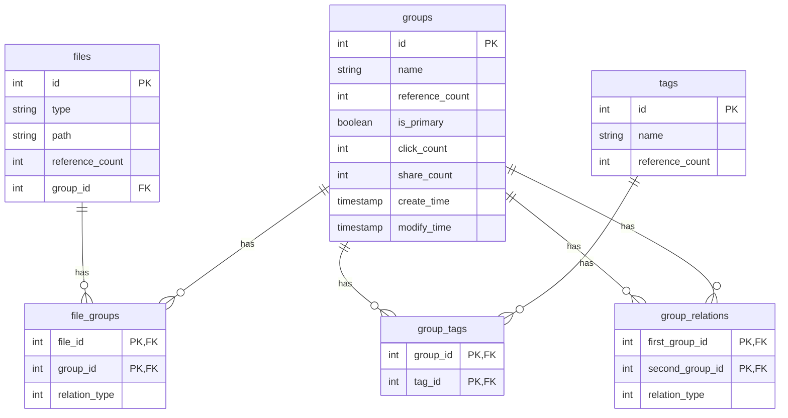

# FileClassificationSolutions 项目结构

这是一个基于 Rust 的文件分类解决方案，采用模块化架构设计，包含核心库、命令行界面和 Web API 等多个组件。

## 项目整体结构

```
FileClassificationSolutions/
├── .github/                    # GitHub 相关配置
│   └── workflows/             # CI/CD 工作流配置
├── common/                     # 公共模块
│   ├── src/                   # 源代码
│   │   ├── env_loader.rs      # 环境变量加载器
│   │   └── lib.rs             # 库入口
│   └── Cargo.toml             # 包配置
├── file_classification_cli/   # 命令行界面应用
│   ├── example/               # 示例脚本文件
│   │   ├── hierarchical_classification.fcc
│   │   ├── hybrid_classification.fcc
│   │   ├── tag_based_classification.fcc
│   │   └── website_classification.fcc
│   ├── src/                   # 源代码
│   │   ├── cli.rs             # CLI 命令解析
│   │   ├── context.rs         # 上下文管理
│   │   ├── handlers.rs        # 命令处理器
│   │   ├── helpers.rs         # 辅助函数
│   │   ├── interactive.rs     # 交互式功能
│   │   ├── main.rs            # 应用入口
│   │   ├── parsers.rs         # 解析器
│   │   ├── repl.rs            # REPL 实现
│   │   └── utils.rs           # 工具函数
│   ├── tests/                 # 测试代码
│   │   └── cli.rs
│   └── Cargo.toml             # CLI 包配置
├── file_classification_core/  # 核心库
│   ├── src/
│   │   ├── internal/          # 数据访问层
│   │   │   ├── file_group.rs  # 文件组关联数据访问
│   │   │   ├── files.rs       # 文件数据访问
│   │   │   ├── group_relations.rs # 组关系数据访问
│   │   │   ├── group_tag.rs   # 组标签关联数据访问
│   │   │   ├── groups.rs      # 组数据访问
│   │   │   ├── mod.rs         # 模块声明
│   │   │   └── tags.rs        # 标签数据访问
│   │   ├── model/             # 数据模型
│   │   │   ├── mod.rs         # 模块声明
│   │   │   ├── models.rs      # 所有数据结构定义
│   │   │   └── schema.rs      # 数据库模式 (由 Diesel 生成)
│   │   ├── service/           # 业务逻辑层
│   │   │   ├── file_group.rs  # 文件组关联业务逻辑
│   │   │   ├── files.rs       # 文件业务逻辑
│   │   │   ├── group_relations.rs # 组关系业务逻辑
│   │   │   ├── group_tag.rs   # 组标签关联业务逻辑
│   │   │   ├── groups.rs      # 组业务逻辑
│   │   │   ├── mod.rs         # 模块声明
│   │   │   └── tags.rs        # 标签业务逻辑
│   │   ├── utils/             # 工具函数
│   │   │   ├── database.rs    # 数据库连接管理
│   │   │   ├── errors.rs      # 错误处理
│   │   │   └── mod.rs         # 模块声明
│   │   └── lib.rs             # 库入口
│   └── Cargo.toml             # 核心库包配置
├── file_classification_webapi/ # Web API
│   ├── src/bin/               # 二进制文件
│   │   ├── handlers/          # API 请求处理函数
│   │   │   ├── file_groups.rs # 文件组关联 API 处理
│   │   │   ├── files.rs       # 文件 API 处理
│   │   │   ├── group_relations.rs # 组关系 API 处理
│   │   │   ├── group_tags.rs  # 组标签关联 API 处理
│   │   │   ├── groups.rs      # 组 API 处理
│   │   │   ├── mod.rs         # 模块声明
│   │   │   ├── tags.rs        # 标签 API 处理
│   │   │   └── uploads.rs     # 文件上传 API 处理
│   │   ├── utils/             # Web API 工具函数
│   │   │   ├── app_config.rs  # 应用配置
│   │   │   ├── cors.rs        # CORS 配置
│   │   │   ├── database.rs    # 数据库连接池
│   │   │   ├── logger.rs      # 日志配置
│   │   │   ├── mod.rs         # 模块声明
│   │   │   ├── models.rs      # API 数据传输对象
│   │   │   ├── server.rs      # 服务器配置
│   │   │   └── static_files.rs # 静态文件服务
│   │   └── file_classification_webapi.rs # Web API 入口
│   ├── static/                # 静态资源
│   │   ├── js/                # JavaScript 文件
│   │   │   ├── config.js
│   │   │   ├── fileGroupManager.js
│   │   │   ├── fileManager.js
│   │   │   ├── groupManager.js
│   │   │   ├── groupRelationManager.js
│   │   │   ├── groupTagManager.js
│   │   │   ├── loader.js
│   │   │   ├── main.js
│   │   │   ├── tagManager.js
│   │   │   └── utils.js
│   │   ├── partials/          # HTML 片段
│   │   │   ├── file-groups.html
│   │   │   ├── files.html
│   │   │   ├── group-relations.html
│   │   │   ├── group-tags.html
│   │   │   ├── groups.html
│   │   │   ├── header.html
│   │   │   ├── home.html
│   │   │   ├── modal.html
│   │   │   ├── sidebar.html
│   │   │   └── tags.html
│   │   ├── index.html         # 主页面
│   │   ├── styles.css         # 样式表
│   │   └── favicon.ico        # 网站图标
│   └── Cargo.toml             # Web API 包配置
├── migrations/                # Diesel 数据库迁移脚本
├── migrations_mysql/          # MySQL 数据库迁移脚本
├── migrations_postgres/       # PostgreSQL 数据库迁移脚本
├── migrations_sqlite/         # SQLite 数据库迁移脚本
└── nix/                      # Nix 包管理配置
```


## 核心模块详解

### file_classification_core (核心库)

这是整个项目的业务逻辑核心，包含了数据模型、数据库访问层和业务服务。

#### 目录结构
```
file_classification_core/
├── src/
│   ├── internal/              # 数据访问层 (DAO)
│   │   ├── file_group.rs      # 文件组关联数据访问
│   │   ├── files.rs           # 文件数据访问
│   │   ├── group_relations.rs # 组关系数据访问
│   │   ├── group_tag.rs       # 组标签关联数据访问
│   │   ├── groups.rs          # 组数据访问
│   │   ├── mod.rs             # 模块声明
│   │   └── tags.rs            # 标签数据访问
│   ├── model/                 # 数据模型
│   │   ├── mod.rs             # 模块声明
│   │   ├── models.rs          # 所有数据结构定义
│   │   └── schema.rs          # 数据库模式 (由 Diesel 生成)
│   ├── service/               # 业务逻辑层
│   │   ├── file_group.rs      # 文件组关联业务逻辑
│   │   ├── files.rs           # 文件业务逻辑
│   │   ├── group_relations.rs # 组关系业务逻辑
│   │   ├── group_tag.rs       # 组标签关联业务逻辑
│   │   ├── groups.rs          # 组业务逻辑
│   │   ├── mod.rs             # 模块声明
│   │   └── tags.rs            # 标签业务逻辑
│   ├── utils/                 # 工具函数
│   │   ├── database.rs        # 数据库连接管理
│   │   ├── errors.rs          # 错误处理
│   │   └── mod.rs             # 模块声明
│   └── lib.rs                 # 库入口
└── Cargo.toml                 # 包配置文件
```


#### 核心概念
- **Files（文件）**: 代表系统中的具体文件，包含类型、路径、引用计数等属性
- **Groups（组）**: 用于对文件进行分类和组织，具有名称、引用计数、主组标识等属性
- **Tags（标签）**: 为组提供额外的元数据描述，增强分类能力
- **FileGroups（文件组关联）**: 建立文件与组之间的多对多关系
- **GroupTags（组标签关联）**: 建立组与标签之间的多对多关系

#### 设计原则
1. 使用引用计数来追踪实体之间的关联关系
2. 支持复杂的条件查询，包括等于、大于、小于、LIKE模式匹配等
3. 实现了完整的CRUD操作，包括通过条件批量操作
4. 采用事务确保数据一致性，特别是在处理引用计数时
5. 区分主组和普通组，主组与文件具有一对一关系

### file_classification_cli (命令行界面)

提供命令行工具来操作文件分类系统。

#### 目录结构
```
file_classification_cli/
├── example/                   # 示例脚本文件
│   ├── hierarchical_classification.fcc
│   ├── hybrid_classification.fcc
│   ├── tag_based_classification.fcc
│   └── website_classification.fcc
├── src/                       # 源代码
│   ├── cli.rs                 # CLI 命令解析
│   ├── context.rs             # 上下文管理
│   ├── handlers.rs            # 命令处理器
│   ├── helpers.rs             # 辅助函数
│   ├── interactive.rs         # 交互式功能
│   ├── main.rs                # 应用入口
│   ├── parsers.rs             # 解析器
│   ├── repl.rs                # REPL 实现
│   └── utils.rs               # 工具函数
├── tests/                     # 测试代码
│   └── cli.rs
└── Cargo.toml                 # 包配置文件
```


#### 功能特点
- 提供交互式命令行界面和 REPL 环境
- 支持复杂的条件查询和批量操作
- 包含完整的增删改查功能
- 支持组合条件查询（AND、OR、NOT）
- 提供多种分类方案示例配置

### file_classification_webapi (Web API)

基于 Actix-web 框架构建的 RESTful API 服务。

#### 目录结构
```
file_classification_webapi/
├── src/bin/
│   ├── handlers/              # API 请求处理函数
│   │   ├── file_groups.rs     # 文件组关联 API 处理
│   │   ├── files.rs           # 文件 API 处理
│   │   ├── group_relations.rs # 组关系 API 处理
│   │   ├── group_tags.rs      # 组标签关联 API 处理
│   │   ├── groups.rs          # 组 API 处理
│   │   ├── mod.rs             # 模块声明
│   │   ├── tags.rs            # 标签 API 处理
│   │   └── uploads.rs         # 文件上传 API 处理
│   ├── utils/                 # Web API 工具函数
│   │   ├── app_config.rs      # 应用配置
│   │   ├── cors.rs            # CORS 配置
│   │   ├── database.rs        # 数据库连接池
│   │   ├── logger.rs          # 日志配置
│   │   ├── mod.rs             # 模块声明
│   │   ├── models.rs          # API 数据传输对象
│   │   ├── server.rs          # 服务器配置
│   │   └── static_files.rs    # 静态文件服务
│   └── file_classification_webapi.rs # Web API 入口
├── static/                    # 静态资源
│   ├── js/                    # JavaScript 文件
│   │   ├── config.js
│   │   ├── fileGroupManager.js
│   │   ├── fileManager.js
│   │   ├── groupManager.js
│   │   ├── groupRelationManager.js
│   │   ├── groupTagManager.js
│   │   ├── loader.js
│   │   ├── main.js
│   │   ├── tagManager.js
│   │   └── utils.js
│   ├── partials/              # HTML 片段
│   │   ├── file-groups.html
│   │   ├── files.html
│   │   ├── group-relations.html
│   │   ├── group-tags.html
│   │   ├── groups.html
│   │   ├── header.html
│   │   ├── home.html
│   │   ├── modal.html
│   │   ├── sidebar.html
│   │   └── tags.html
│   ├── index.html             # 主页面
│   ├── styles.css             # 样式表
│   └── favicon.ico            # 网站图标
└── Cargo.toml                 # 包配置文件
```


#### API 端点
- **文件管理**: `/api/files`
- **组管理**: `/api/groups`
- **标签管理**: `/api/tags`
- **文件组关联**: `/api/file-groups`
- **组标签关联**: `/api/group-tags`
- **组关系**: `/api/group-relations`
- **文件上传**: `/api/uploads`

### 数据库迁移

项目支持多种数据库，每种数据库都有对应的迁移脚本：

```
migrations/                    # Diesel 默认迁移
migrations_mysql/             # MySQL 迁移
migrations_postgres/          # PostgreSQL 迁移
migrations_sqlite/            # SQLite 迁移
```

每个迁移目录包含：
```
└── 2024-10-01-193345_FileClassification/
    ├── up.sql                 # 数据库表创建脚本
    └── down.sql               # 数据库表删除脚本
```

后续迁移：
- `2025-10-20-000000_update_group_hierarchy` - 更新组层次结构
- `2025-11-02-000000_add_description_fields` - 添加描述字段


数据库包含以下表：
- `files`: 存储文件信息
- `groups`: 存储文件组信息
- `file_groups`: 文件和组的多对多关联关系
- `tags`: 存储标签信息
- `group_tags`: 组和标签的多对多关联关系

### 数据模型关系




## 架构特点

1. **分层架构**: 项目采用清晰的分层架构，将数据访问、业务逻辑和表示层分离
2. **模块化设计**: 不同的功能模块被组织在独立的 crate 中
3. **多种访问方式**: 提供 CLI 和 Web API 两种访问方式
4. **强类型安全**: 利用 Rust 的类型系统保证代码安全
5. **错误处理**: 统一的错误处理机制
6. **数据库抽象**: 使用 Diesel ORM 进行数据库操作
7. **可扩展性**: 易于添加新的功能模块和访问接口

这个项目结构设计支持对文件进行分类管理，通过组和标签的方式组织文件，并提供多种访问接口以适应不同使用场景。