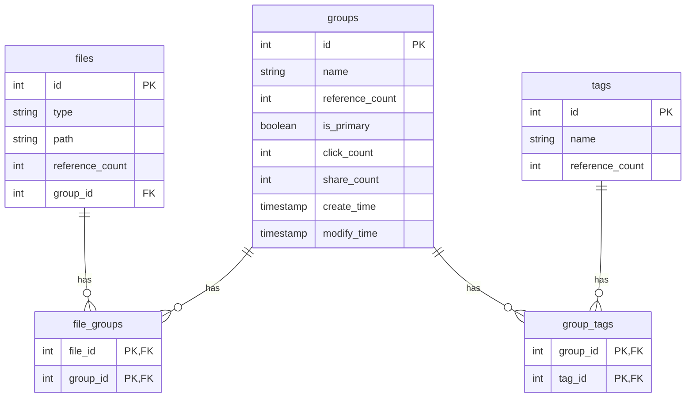

# FileClassificationSolutions 项目结构

这是一个基于 Rust 的文件分类解决方案，采用模块化架构设计，包含核心库、命令行界面和 Web API 等多个组件。

## 项目整体结构

```
FileClassificationSolutions/
├── .github/                    # GitHub 相关配置
│   └── workflows/             # CI/CD 工作流配置
├── file_classification_cli/   # 命令行界面应用
│   ├── src/bin/               # 各个独立的命令行工具
│   └── Cargo.toml             # CLI 包配置
├── file_classification_core/  # 核心库
│   ├── src/
│   │   ├── internal/          # 数据访问层
│   │   ├── model/             # 数据模型和数据库模式
│   │   ├── service/           # 业务逻辑层
│   │   └── utils/             # 工具函数
│   └── Cargo.toml             # 核心库包配置
├── file_classification_webapi/ # Web API (旧版)
│   ├── src/bin/               # 各个独立的API端点
│   └── Cargo.toml             # Web API 包配置
├── file_classification_webapi2/ # Web API (新版)
│   ├── src/
│   │   ├── handlers/          # 请求处理函数
│   │   └── utils/             # Web API 工具函数
│   └── Cargo.toml             # Web API2 包配置
├── migrations/                # 数据库迁移脚本
└── nix/                      # Nix 包管理配置
```


## 核心模块详解

### file_classification_core (核心库)

这是整个项目的业务逻辑核心，包含了数据模型、数据库访问层和业务服务。

#### 目录结构
```
file_classification_core/
├── src/
│   ├── internal/              # 数据访问层 (DAO)
│   │   ├── file_group.rs      # 文件组关联数据访问
│   │   ├── files.rs           # 文件数据访问
│   │   ├── group_tag.rs       # 组标签关联数据访问
│   │   ├── groups.rs          # 组数据访问
│   │   └── tags.rs            # 标签数据访问
│   ├── model/                 # 数据模型
│   │   ├── models.rs          # 所有数据结构定义
│   │   └── schema.rs          # 数据库模式 (由 Diesel 生成)
│   ├── service/               # 业务逻辑层
│   │   ├── file_group.rs      # 文件组关联业务逻辑
│   │   ├── files.rs           # 文件业务逻辑
│   │   ├── group_tag.rs       # 组标签关联业务逻辑
│   │   ├── groups.rs          # 组业务逻辑
│   │   └── tags.rs            # 标签业务逻辑
│   └── utils/                 # 工具函数
│       ├── database.rs        # 数据库连接管理
│       └── errors.rs          # 错误处理
└── Cargo.toml                 # 包配置文件
```


### file_classification_cli (命令行界面)

提供命令行工具来操作文件分类系统。

#### 目录结构
```
file_classification_cli/
├── src/bin/                   # 各个独立的命令行工具
│   ├── create_file_group.rs   # 创建文件组关联
│   ├── create_group.rs        # 创建组
│   ├── create_group_tag.rs    # 创建组标签关联
│   ├── create_tag.rs          # 创建标签
│   ├── delete_file.rs         # 删除文件
│   ├── delete_file_group.rs   # 删除文件组关联
│   ├── delete_group.rs        # 删除组
│   ├── delete_group_tag.rs    # 删除组标签关联
│   ├── delete_tag.rs          # 删除标签
│   ├── list_file_groups_by_conditions.rs  # 条件查询文件组关联
│   ├── list_files.rs          # 列出文件
│   ├── list_files_by_conditions.rs        # 条件查询文件
│   ├── list_group_tags_by_conditions.rs   # 条件查询组标签关联
│   ├── list_groups.rs         # 列出组
│   ├── list_groups_by_conditions.rs       # 条件查询组
│   ├── list_tags.rs           # 列出标签
│   ├── list_tags_by_conditions.rs         # 条件查询标签
│   ├── update_files_by_conditions.rs      # 条件更新文件
│   ├── update_groups_by_conditions.rs     # 条件更新组
│   └── update_tags_by_conditions.rs       # 条件更新标签
└── Cargo.toml                 # 包配置文件
```


### file_classification_webapi2 (Web API - 新版)

基于 Actix-web 框架构建的 RESTful API 服务。

#### 目录结构
```
file_classification_webapi2/
├── src/
│   ├── handlers/              # API 请求处理函数
│   │   ├── file_groups.rs     # 文件组关联 API 处理
│   │   ├── files.rs           # 文件 API 处理
│   │   ├── group_tags.rs      # 组标签关联 API 处理
│   │   ├── groups.rs          # 组 API 处理
│   │   ├── mod.rs             # 模块声明
│   │   └── tags.rs            # 标签 API 处理
│   ├── utils/                 # Web API 工具函数
│   │   ├── database.rs        # 数据库连接池
│   │   ├── mod.rs             # 模块声明
│   │   └── models.rs          # API 数据传输对象
│   └── main.rs                # 应用入口点
└── Cargo.toml                 # 包配置文件
```


### 数据库迁移

```
migrations/
└── 2024-10-01-193345_FileClassification/
    ├── up.sql                 # 数据库表创建脚本
    └── down.sql               # 数据库表删除脚本
```


数据库包含以下表：
- `files`: 存储文件信息
- `groups`: 存储文件组信息
- `file_groups`: 文件和组的多对多关联关系
- `tags`: 存储标签信息
- `group_tags`: 组和标签的多对多关联关系

### 数据模型关系




## 架构特点

1. **分层架构**: 项目采用清晰的分层架构，将数据访问、业务逻辑和表示层分离
2. **模块化设计**: 不同的功能模块被组织在独立的 crate 中
3. **多种访问方式**: 提供 CLI 和 Web API 两种访问方式
4. **强类型安全**: 利用 Rust 的类型系统保证代码安全
5. **错误处理**: 统一的错误处理机制
6. **数据库抽象**: 使用 Diesel ORM 进行数据库操作
7. **可扩展性**: 易于添加新的功能模块和访问接口

这个项目结构设计支持对文件进行分类管理，通过组和标签的方式组织文件，并提供多种访问接口以适应不同使用场景。